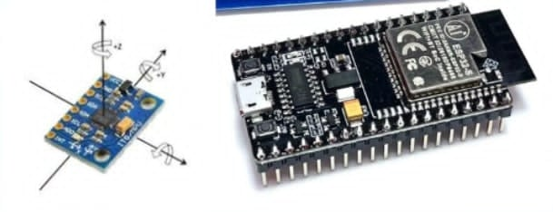
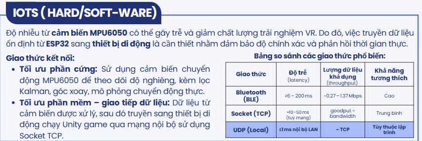
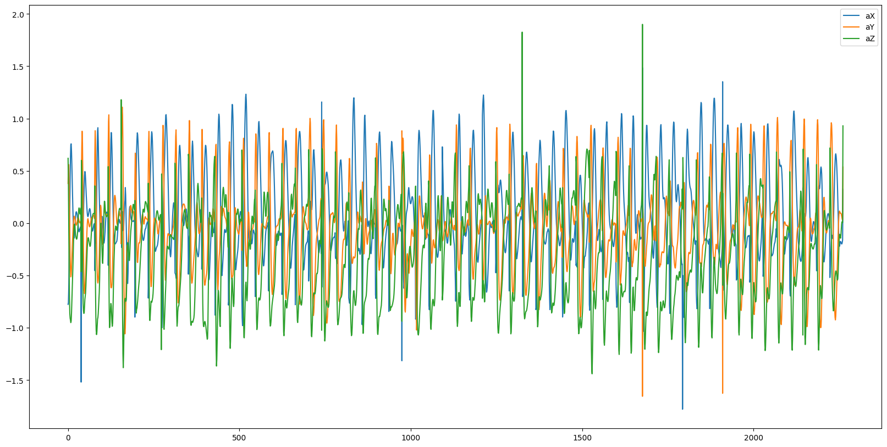
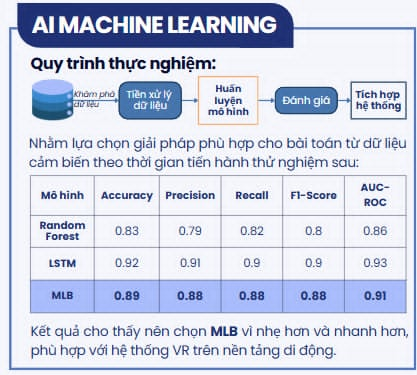

# 🎮 VR Mobile Shooting Game - Hardware Integration with ESP32 & MPU6050

This project is a part of our final-year capstone, aiming to deliver a highly immersive and affordable mobile VR shooting experience. The system integrates a custom-designed gun-shaped controller equipped with an MPU6050 motion sensor and an ESP32 microcontroller. These components work together to track real-time motion and interact seamlessly with a Unity-based VR environment on Android.

## 🔧 Hardware Overview

Our controller is based on the ESP32 Dev Board, which offers built-in WiFi and BLE connectivity. Paired with the MPU6050, a 6-axis motion tracking device (gyroscope + accelerometer), the system captures tilt, rotation, and acceleration data from the user's hand movements. This data is then processed and sent wirelessly to a mobile phone running a Unity VR game.

The physical controller is designed to mimic the feel of a gun, enhancing realism and immersion. It includes trigger functionality mapped to firing actions in-game.

## 🔁 Communication Protocol

To ensure low-latency data transfer, we utilize the UDP protocol over a local Wi-Fi network. This allows real-time communication (typically ≤1ms within LAN) between the ESP32 and the mobile phone. For testing and comparison, we also experimented with BLE and TCP socket protocols, though UDP provided the best balance of speed and compatibility.

## 🔍 Sensor Data Processing

The raw data from MPU6050 is noisy by nature. We apply a Kalman Filter in the ESP32 firmware to stabilize orientation readings, ensuring smooth gameplay. The processed pitch, roll, and yaw values are sent at a consistent frame rate to maintain accuracy. Button presses (e.g. trigger action) are also transmitted.

## 🤖 AI & Machine Learning

To increase player immersion, we integrated **AI bots** and **behavioral analytics** using machine learning techniques. Player actions and motion patterns are captured through gameplay, and the following models were tested for classification and prediction:

| Model         | Accuracy | Precision | Recall | F1-Score | AUC |
|---------------|----------|-----------|--------|----------|-----|
| Random Forest | 0.83     | 0.79      | 0.82   | 0.80     | 0.86 |
| LSTM          | 0.92     | 0.91      | 0.90   | 0.90     | 0.93 |
| MLPs           | 0.89     | 0.88      | 0.88   | 0.88     | 0.91 |

We selected **MLPs** as the final model for its balance between accuracy and computational efficiency on mobile platforms. The trained model can:
- Detect and respond to user behavior in real time
- Adapt enemy AI difficulty based on player skill level
- Personalize the gaming experience

Data was collected, preprocessed in Python, and models were integrated into the game logic using socket communication.

## ⚙️ Development Environment

We use PlatformIO with the Arduino framework for ESP32 firmware development. On the Unity side, a mobile VR environment is developed using Google Cardboard SDK. Multiplayer functionality is enabled via Photon Unity Networking (PUN), allowing multiple users to interact in the same VR space.
- **Firmware**: PlatformIO + Arduino (ESP32)
- **Game Engine**: Unity 3D (Mobile VR, Cardboard SDK)
- **Networking**: UDP sockets + Photon Unity Networking (for multiplayer)
- **ML Training**: Python (scikit-learn, TensorFlow)
- **Data Visualization**: Matplotlib, seaborn

## 🎮 Live Demo

Here is a short demo showing the controller in action with Unity:

## 📦 Code Structure

- `/src`: Main firmware files (motion tracking, communication)
- `/lib`: External libraries (MPU6050, Kalman filter, WiFi)
- `platformio.ini`: PlatformIO project configuration

## 📌 Why ESP32 + MPU6050?

The combination of ESP32 and MPU6050 provides a powerful yet low-cost solution for building motion-aware devices. ESP32’s wireless capability enables flexible communication, while MPU6050’s motion sensing brings realistic interaction to VR. Together, they form a responsive system that bridges physical motion with digital action.

## ⚠️ Limitations

While effective, the system has several hardware constraints:
- MPU6050 can be sensitive to electromagnetic interference, requiring proper shielding and calibration.
- Battery-powered ESP32 modules may need power optimization for extended use.
- The accuracy still lags behind high-end VR systems (e.g. Oculus/SteamVR).

## 🚀 Future Directions

We plan to improve this prototype by:
- Integrating higher-precision sensors like MPU9250 or BNO055.
- Adding haptic feedback using vibration motors.
- Extending controller support to dual-hand tracking.
- Expanding to more VR applications such as education, simulation, and training.

## 🧠 Conclusion

This project demonstrates how a simple yet thoughtful hardware setup can dramatically improve mobile VR interaction. By combining ESP32 and MPU6050 with Unity, we create a responsive, affordable, and immersive experience that challenges the limitations of mobile VR platforms.
